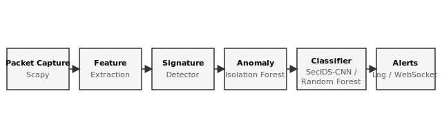
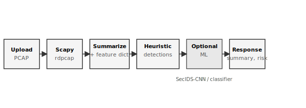
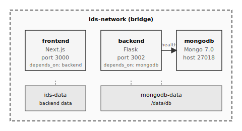

# IDS — AI-Powered Real-Time Intrusion Detection System

An intrusion detection system that combines real-time packet monitoring (Scapy) with multi-layer detection: signature-based pattern matching, Isolation Forest anomaly detection, and supervised ML classification (SecIDS-CNN by default, or Random Forest). Alerts and traffic stats are persisted in MongoDB, exposed via a Flask REST API and Socket.IO for live updates, and visualized in a Next.js dashboard.

## Overview

The system captures live packets (or accepts test packets via API), runs them through signature rules, an anomaly detector (Isolation Forest), and an optional supervised classifier (SecIDS-CNN pre-trained CNN or other sklearn models). Detections produce alerts and traffic statistics stored in MongoDB; the Next.js frontend consumes the REST API and Socket.IO for real-time updates.

## Capabilities

- **Real-time packet capture** — Live packet analysis using Scapy with configurable interface and auto-start
- **Signature-based detection** — Pattern matching for known attacks (SQL injection, XSS, port scan, DoS, brute force, malware communication, data exfiltration)
- **Anomaly detection** — Isolation Forest for unsupervised detection of unusual traffic patterns
- **Supervised classification** — SecIDS-CNN (pre-trained, default) or Random Forest / XGBoost / SVM / Logistic Regression trained on labeled data
- **PCAP analysis** — Upload and analyze PCAP files with configurable packet limit and timeout
- **Alert management** — List, filter, resolve, delete alerts; bulk delete and bulk resolve; history and summary endpoints
- **Traffic statistics** — Protocol distribution, connection tracking, real-time stats, anomaly listings
- **Real-time dashboard** — WebSocket (Socket.IO) updates for traffic and new alerts
- **Training pipeline** — Label samples, import data, train models, evaluate, metrics, confusion matrix, training history
- **Rate limiting** — Flask-Limiter with default and per-endpoint limits
- **Health and system info** — `/api/health` and `/api/system/info` for status and configuration

## Architecture

High-level components and data flow:


Detection path from packet capture to alerts:



PCAP-specific analysis flow:



1. **Packet capture** — Scapy captures live packets (or test packets are injected via API).
2. **Analysis** — Packets are processed by the analyzer: signature rules, Isolation Forest, and (when enabled) supervised classifier (e.g. SecIDS-CNN).
3. **Persistence** — Alerts and traffic statistics are written to MongoDB (collections: `alerts`, `traffic_stats`, `user_activities`, `pcap_analyses`; default database: `ids_db`).
4. **API and real-time** — Flask REST API and Socket.IO serve the Next.js app; Next.js API routes under `app/api/` proxy to the Flask backend using `FLASK_API_URL`.

Docker deployment layout:



## How to Get Started

### Prerequisites

- Docker and Docker Compose (recommended), or
- Node.js 18+, Python 3.12+, MongoDB 7.0 for local development

### Quick start (Docker)

From the project root:

```bash
docker compose up --build -d
```

Or use the convenience script:

```bash
./start-all.sh
```

- Frontend: http://localhost:3000  
- Backend API: http://localhost:3002  
- MongoDB: host port 27018 (see `docker-compose.yml`)

### Local development

- **Backend:** Copy `backend/env.example` to `backend/.env`, set `MONGODB_URI` and other variables. Run `backend/start.sh` from the `backend` directory.
- **Frontend:** Set `NEXT_PUBLIC_FLASK_API_URL=http://localhost:3002` (or use `.env.local`). Run `npm run dev` from the project root.
- **Training (optional):** Use `backend/start_training.sh` for training-related scripts; see [backend/README.md](backend/README.md).

See [backend/env.example](backend/env.example) and [backend/docs/SECIDS_CNN.md](backend/docs/SECIDS_CNN.md) for configuration and SecIDS-CNN usage.

## Technical specifications

| Layer       | Technologies |
|------------|--------------|
| **Frontend**  | Next.js 16, React 19, TypeScript, Tailwind CSS 4, Radix UI, Recharts, socket.io-client, Lucide React |
| **Backend**   | Python 3.12, Flask 3, Flask-CORS, Flask-SocketIO, Flask-Limiter, Scapy, PyMongo, scikit-learn, imbalanced-learn, xgboost-cpu, TensorFlow (for SecIDS-CNN) |
| **Data**      | MongoDB 7.0 |
| **Deployment**| Docker, multi-stage Dockerfile (backend + frontend; optional single-image) |

Classification defaults to the pre-trained SecIDS-CNN model; see [backend/docs/SECIDS_CNN.md](backend/docs/SECIDS_CNN.md) and [SecIDS-CNN/README.md](SecIDS-CNN/README.md).

## Performance (SecIDS-CNN evaluation)

| Metric    | Value   |
|----------|---------|
| Accuracy | 97.72%  |
| Precision| 97.74%  |
| Recall   | 97.72%  |
| F1-Score | 0.9772  |

## Documentation

- [backend/docs/SECIDS_CNN.md](backend/docs/SECIDS_CNN.md) — SecIDS-CNN integration and input/output
- [SecIDS-CNN/README.md](SecIDS-CNN/README.md) — Model source and usage (Hugging Face: [Keyven/SecIDS-CNN](https://huggingface.co/Keyven/SecIDS-CNN))
- Diagram sources: `public/docs/architecture-system.svg`, `public/docs/detection-pipeline.svg`, `public/docs/pcap-analysis-flow.svg`, `public/docs/deployment-docker.svg`

## License

MIT. SecIDS-CNN model is under Creative Commons Attribution Non Commercial 4.0 (cc-by-nc-4.0); see [SecIDS-CNN/README.md](SecIDS-CNN/README.md).
